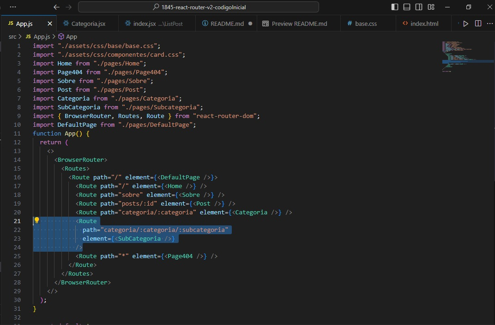

# Nueva Resolución Proyecto Curso React Router DOM

El curso 4 de la formación de React en el cual se implementa la librería React Router DOM tiene algunos problemas en la implementación de la librería en la sección de rutas anidadas. El motivo de tal problema radica que el instructor usa los componentes Routes y Route **DENTRO** de una página (la página llamada Categoría) y lo anterior, si bien funciona el código (hace lo que se desea), no se condice con la documentación en la cual las rutas se definen en **SOLO** un archivo siendo este el archivo que contendrá todas las rutas. En general, dicho archivo será aquel que irá directo en el index.js, es decir, dicho archivo será el **App.js**. Para solucionar dicho problema he establecido las rutas en el archivo App.js y **solo** allí se encuentran las rutas del sitio. Además, el instructor rompe su línea de explicación al no crear un componente que abstrae la lógica del mismo modo como lo estaba haciendo antes de llegar al punto que genera el problema. Para solucionar tales problemas de explicación y para dejar muy claro como utilizar de manera más clara la librería, he reconstruido el código del instructor desde la parte que genera el problema y a continuación muestro los problemas que acabo de señalar con mi implementación la cual se verá que es mucho más intuitiva y lógica.

# Comparación de código de Instructor versus mi código

En la imagen de abajo muestro el código del instructor el cual utiliza los componentes Routes y Route en una página llamada Categoría de modo tal de implementar rutas anidadas. Si bien el código funciona, se rompe lo indicado en la documentación que es crear las rutas en solo un archivo, no en las mismas páginas.

A continuación muestro como he resuelto tal problema. He creado en el mismo archivo donde se encuentra todo el resto de rutas, las rutas anidadas (siguiendo la documentación) para mostrar la página de subcategorías.

Lo anterior soluciona el problema de crear componentes Routes y Route en una página ya que se rompe la filosofía de agrupar todas las rutas en solo un archivo.

Ahora bien, al crear las rutas anidadas en el archivo App.js se requiere reconstruir la página llamada Subcategoría. Dicha página es similar a la página llamada Categoría y solo cambiará la URL con las rutas anidadas. Ahora bien, como se observa en el código del instructor, la página Categoría que el realiza **NO** aisla a un componente tal y como lo venía haciendo hasta antes de llegar aquí. Como se observa en la imagen de abajo, el código seleccionado representa a un NUEVO componente el cual no esta aislado tal y como se ha hecho con el componente que esta, inmediatamente, arriba llamado: `<ListCategories />`.

Para solucionar dicho problema, he creado un NUEVO componente que aisla dicha lógica.El componente lo he llamado **ListSubcategorias** y permite aislar la lógica del mismo modo como se ha hecho con el componente llamado `<ListCategories />` que el mismo instructor ha realizado.

Habiendo creado el componente **ListSubcategorias** debo reconstruir la página llamada Subcategoria. La página Subcategoría del instructor es la siguiente:

La página Subcategoría reconstruida en base a mis soluciones queda así:

Como se puede observar en la nueva página hago uso del componente `<ListSubCategorias />` que he creado y descrito en los parrafos anteriores.

De este modo, he reconstruido el proyecto del instructor en base a los lineamientos dados por la documentación y se observa que este método es mucho más intuitivo y fácil de seguir que el usado por el instructor.

Además de todo lo anterior, en las páginas categorías y subcategorías he agregado nuevos campos que dejan más claro qué categoría o subcategoría se ha seleccionado. También en cada card de post he puesto a qué categoría y subcategoría pertenece cada posteo. Por último, he desplegado una fake API para poder desplegar este proyecto a la web y sea visualizado por todo aquel que posea el link de la aplicación. La fake API se puede visualizar [aquí](https://apicursoreactrouterdom.onrender.com/).

A continuación muestro imagenes del proyecto que he reconstruido:

## Página HOME

En esta página se puede observar que cada card de post posee la categoría y subcategoría a la cual pertenece.

## Página Categoría

En la imagen anterior se observa la página categoría con la categoría **Comportamiento** seleccionada en la cual se muestran las subcategorías que le pertenecen y además sus posts.

## Página Subcategoría

A continuación se muestra la página Subcategoría con la subcategoría seleccionada actual llamada Educación con la categoría a la cual pertenece que es Comportamiento.

